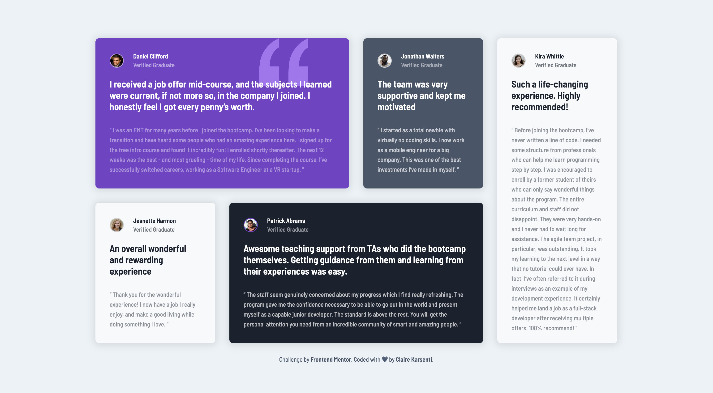
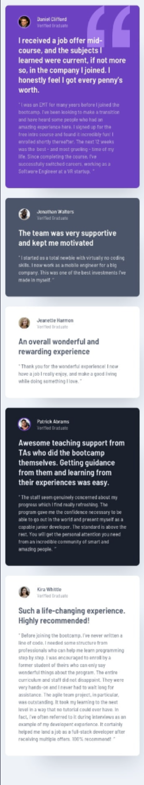
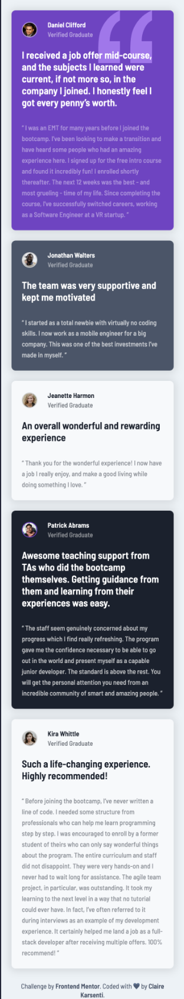
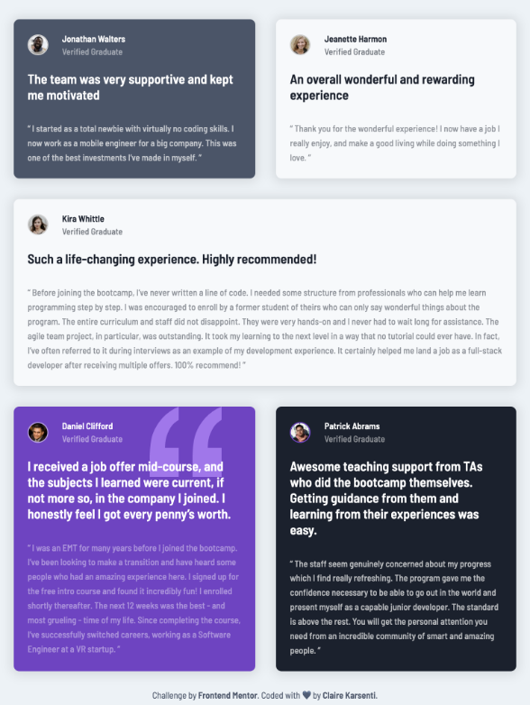

# Frontend Mentor - Testimonials grid section solution

This is a solution to the [Testimonials grid section form challenge on Frontend Mentor](https://www.frontendmentor.io/challenges/testimonials-grid-section-Nnw6J7Un7).
Frontend Mentor challenges help me improve my coding skills by building realistic projects.

## Table of contents

- [Frontend Mentor - Testimonials grid section solution](#frontend-mentor---testimonials-grid-section-solution)
  - [Table of contents](#table-of-contents)
  - [Overview](#overview)
    - [The challenge](#the-challenge)
    - [Models \& my works](#models--my-works)
      - [Desktop version](#desktop-version)
      - [Mobile version](#mobile-version)
      - [Tablet version](#tablet-version)
    - [Links](#links)
  - [My process](#my-process)
    - [Built with](#built-with)
    - [What I learned](#what-i-learned)
    - [Useful resource](#useful-resource)
  - [Author](#author)

## Overview

### The challenge

Users should be able to:

- View the optimal layout for the site depending on their device's screen size.

### Models & my works

#### Desktop version

| Model   |  |
| ------- | ---------------------------------------- |
| My work |             |

#### Mobile version

| Model                                  | My work                     |
| -------------------------------------- | --------------------------- |
|  |  |

#### Tablet version

| My work                                 |
| -------------------------------------- |
|  |

### Links

- Solution URL: [Code on GitHub](https://github.com/ClaireKarsenti/Testimonials-Grid-Section)
- Live Site URL: [GitHub Pages Live URL](https://clairekarsenti.github.io/Testimonials-Grid-Section)

## My process

### Built with

- Semantic HTML5 markup
- CSS custom properties
- Grid
- SASS
- Mobile-first workflow

### What I learned

I choose to do this simple project to experiment with SASS for the first time. This project was also perfect to deepen my knowledge in CSS Grid.

Here are some of my customizations:
- :star2: I added some entrance animations, different for each device to be full responsive.
- :iphone: To work more on the responsive aspect of this project I added a [tablet version](#tablet-version). 

### Useful resource

- [Resource 1](https://www.youtube.com/watch?v=L9rBBbga8ws&t=266s) - This allowed me to be more familiar and to learn the basics of Sass.
- [Resource 2](https://itnext.io/structuring-your-sass-projects-c8d41fa55ed4) - This helped me to structure my Sass project.

## Author

- Linkedin - [Claire Karsenti](https://www.linkedin.com/in/claire-karsenti/)
- Frontend Mentor - [@ClaireKarsenti](https://www.frontendmentor.io/profile/ClaireKarsenti)
